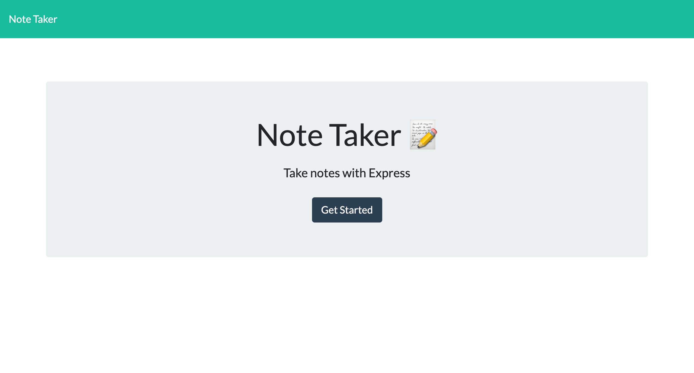
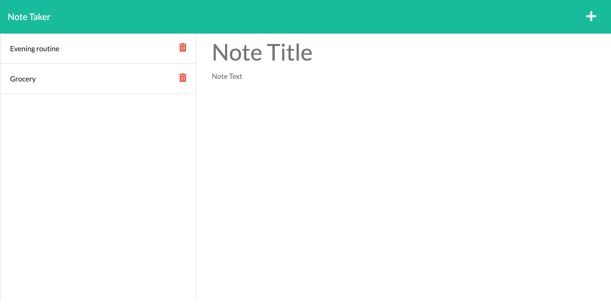

# Module 11 Note Taker

##  Description:

A user is able to write, save and delete notes. This application uses Express.js for the back end. This will save, retrieve and delete notes from the JSON file. This application is deployed in [Heroku](https://note-taker-wirsing.herokuapp.com).

##  Table of Contents 
1. [Installation](#installation)
2. [Usage](#usage) 
3. [Screenshots](#screenshots)
4. [Contributing](#contributing) 
5. [Test](#test) 
6. [Questions](#questions)
7. [License](#license)
8. [Sources](#sources)

## Installation 

This project can be ran from the deployed heroku site: https://note-taker-wirsing.herokuapp.com/ or can be downloaded to a local computer using `git clone <https of this repository>`. Then install the dependencies using `npm i`. 

## Usage 

After installation, the application can be used by running this `node server.js` in the terminal. Once the server is running, open the localhost in a browser.

Otherwise use the deployed app in Heroku: https://note-taker-wirsing.herokuapp.com/

## Screenshots
The index.html or landing page:

The notes.html or notes page:

## Contributing 

Clone this repo, make changes in a branch and create a pull request for the  owner's approval.

## Test 

Experiment with real or made-up notes. Add, view and delete accordingly.

## Questions? 

Please contact me through any of the following:

1. My [Github](https://github.com/iwirsing).
2. Email: <a href="mailto:ivymolina@gmail.com">ivymolina@gmail.com</a>

## License

The project in covered under the [MIT](https://opensource.org/licenses/MIT) license

## Sources
1. https://www.pluralsight.com/guides/javascript-promise-typeerror:-cannot-read-then-of-undefined
2. https://stackoverflow.com/questions/64453111/express-router-delete-returns-404-not-found
3. https://www.npmjs.com/package/method-override